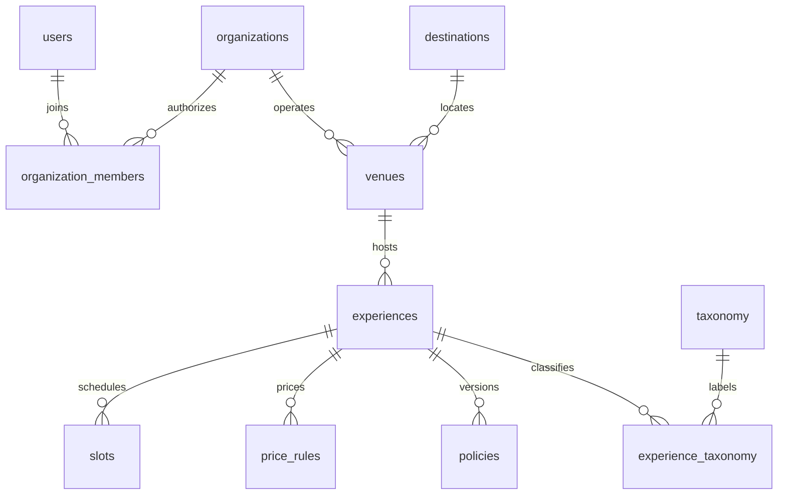
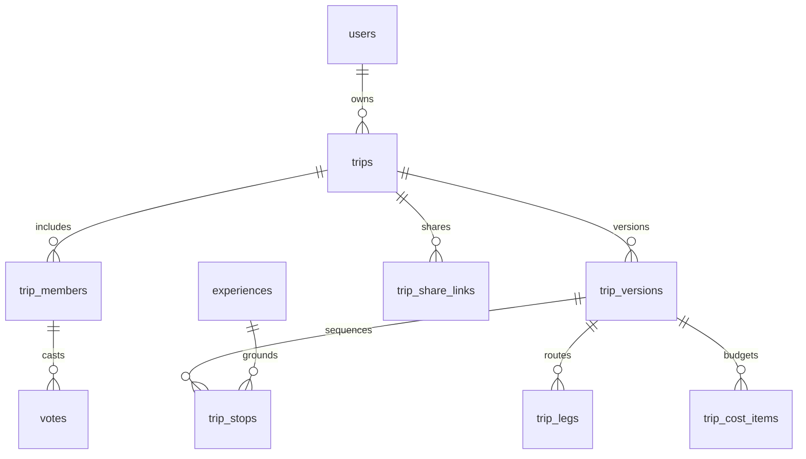
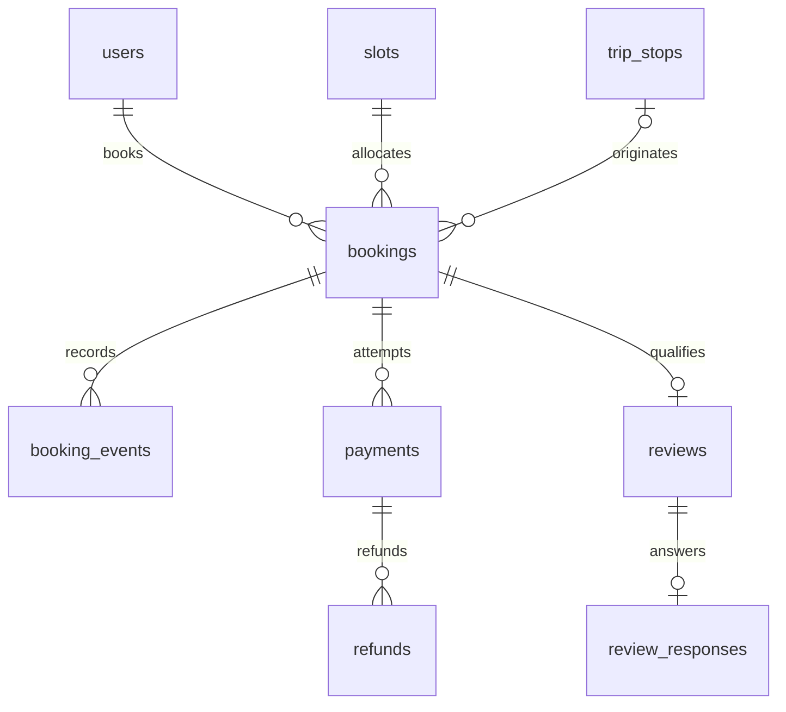
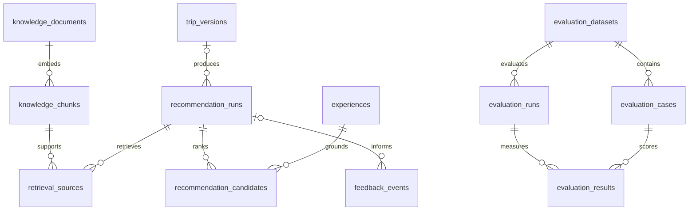

# Mshwar relationship diagrams

These diagrams show the principal enforced foreign-key relationships by domain. See DATA_DICTIONARY.md and the migrations for all columns, constraints and auxiliary tables. Optional relationships such as booking-to-itinerary-stop are intentionally nullable.

## Supply ownership and inventory

Organization/venue identity is also enforced by a composite FK on experiences. Price validity uses an exclusion constraint; it cannot overlap for the same experience and currency.

## Planning and group decisions

Only draft versions can be edited. Sealed versions are immutable. Share tokens are hashed and validated by the backend; they do not become database logins.

## Booking and financial history

A booking has one experience and one slot. Payments and refunds retain independent states. Webhook events are keyed by external provider/account/mode/event identity and are resolved by the provider adapter; they do not use an invented FK to an unknown payment.

## AI evidence and outcomes

Knowledge, learning feedback and fixed evaluation cases are stored separately. Production user edits must never silently rewrite the evaluation dataset.
